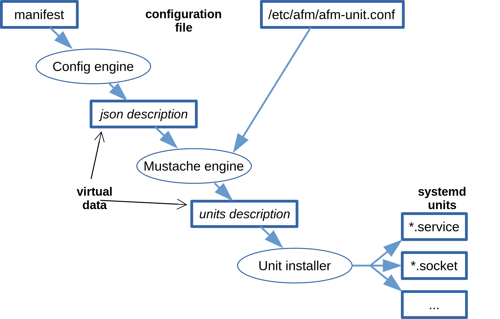

# Application framework of redpesk

## Overview

The application framework of **redpesk**
provides components to install and remove applications
as well as to run them in a secured environment.

The main functionalities are:

- install/remove applications and services

- start/terminate installed applications and services

- answer simple queries: what is installed? what runs?

The application framework fills the gap between the applications
development model and the effective system implementation.

The framework manages applications and hides their security details.
To achieves it, the framework is built on top of security frameworks
of Linux: standard DAC and a MAC module SELinux and/or Smack.


## The packaging of applications

The application framework of redpesk is only responsible of managing
applications packaged for it.

Applications for the framwork are packaged and delivered in a
digitally signed RPM that contains:

* the application and its files: programs, libraries, config, data, ...
* metadata for redpesk framework
   - for newer designs:
      * a configuration file `manifest.yml` in a directory `.rpconfig`
      * some signature files in directory `.rpconfig`
   - for framework before arz-1.1
      * a configuration file `config.xml` in root directory
      * some signature files in root directory

The presence of the directory `.rpconfig` (or for older packaging of
`config.xml`) is the key telling that the package is for the framework.
RPM that do not have that this key are standard RPM.


## Process of installation

When installing a RPM, the system detects if it is a RPM for the
framework or not. When it is a package for the framework, its
metadata are scanned and used for setting up:

1. the DAC and MAC security properties of the installed files
2. the MAC security rules for the package
3. the cynagora permissions granted to the applications
4. the systemd services that setup security and start applications
5. the start dependency graph of applications

The figure below summerize the process.

{:width="60%"}

The framework ensures that sensitive services, devices or resources
of the platform are protected. Applications can access these sensitive
resources only if explicitly permitted to do so.

It also adds the description of dependency to other service because
redpesk programming model emphasis micro-services architecture design.

As today this model allows the distribution of HTML and binary applications
but it could be extended to any other class of applications.

```
IN SOME FUTURE

Signature make possible to allow or deny permissions required by the
application based on certificates of signers.

A chain of trust in the creation of certificates allows a hierarchical
structuring of permissions.

This item is 90% implemented.
```

## The security model

The security model refers to how DAC (Discretionary Access Control),
MAC (Mandatory Access Control) and Capabilities are used by the system
to ensure security and privacy.

The application framework uses the security model/framework
to ensure the security and the privacy of the applications that
it manages.

The security framework includes:

- **sec-lsm-manager**: component that interact with the security module of linux (Smack)
- **sec-cynagora**: component to manage permissions
- **afmpkg-daemon**: component to install and remove packages of the framework
- **redpesk**: RPM plugin in that interacts with afmpkg-installer
- **D-Bus** compliant to Cynagora: checks the permissions to deliver messages

**In theory, the security framework/model is an implementation details
that should not impact the programming model from a user point of view**.

```
IN SOME FUTURE

redpesk framework will include self security diagnostic by analysing audit and log reports.
```

## Systemd services

When applications are installed, the framework creates systemd services
and the dependency graph of the services.

This process, shown on the below figure, uses a configuration file that
can be tuned by implementers.

{:width="60%"}

## Environment setup

Integration of the security framework requires some setting up of directories,
files and permissions. This setup is done at different stages:

- static setting: during creation of the system

- dynamic settings:
     * during installation of applications
     * at system start-up
     * when a user environment is started

The dynamic settings are made using systemd services of the application framework.
These services are:

- **afm-system-setup.service**: global setup of the system at start

- **afm-user-session@.service**: start and hold user session for one user

- **afm-user-setup@.service**: setup the user session started by afm-user-session

